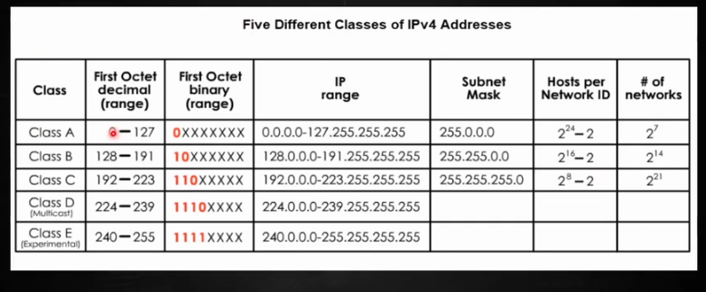
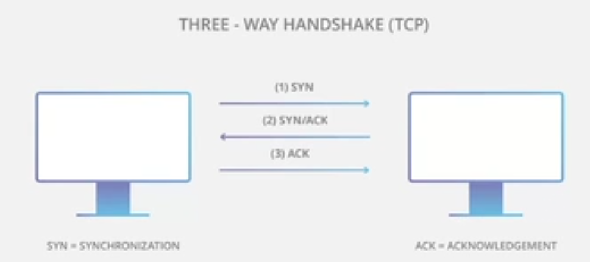
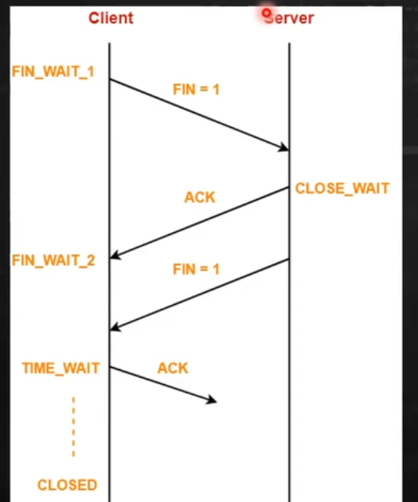

# NETWORKING BASICS
- Network -> connection between 2 or more device, sharing resources between comps
- “A global computer network  providing a variety of info and comm. facilities, consisting of interconnected networks using stanardized communication protocols”
- network of computers worldwide -> Internet
- diff types of networks
   -  LAN
   -  WLAN (wireless lan) – same as LAN uses wireless communication technology
   -  MAN – campus, town, city
   -  WAN – e.g. internet
   -  private network – e.g lan, need authentication to connect
   -  public network no need to authenticate 
   -  VPN (virtual private nw) - connect to public network as if it is connected to private nw
- IP address (internet protocol addr.) - “numerical label assigned to each device connected to a network that uses ip for comm”
- Ipv4 – commonly used, might run out soon
   -  2 parts – host portion and network portion
   -  these parts determined by subnet mask
- Ipv6 – created when ipv4 addresses might run out, not commonly used

## IP ADDRESS CONVERSION [FROM DECIMAL TO BINARY]
- e.g. 192.168.1.1 [each octet has 8 bits]

| 192 | 168 | 1 | 1 |
 ---- | --- | - | -|
| 8 |  8  | 8 | 8 |

| 2^7 | 2^6 | 2^5 | 2^4 | 2^3 | 2^2 | 2^1 | 2^0 |
| --- | --- | --- | --- | --- | --- | --- | --- |
| 128 |  64 |  32 |  16 |  8  |   4 |   2 |  1  |  

#### converting 192 
192 – 128  ---> if subtractable, put 1 and take remainder (here 64)
64 – 64 [in table] ---> put 1  rem 0
0- 32 ---> not possible put 0 , all remaining 0

192 – 1 1 0 0 0 0 0 0 

#### converting 168
168 – 128 = 40 	1 
40 – 64 = not possible, 0
40 – 32 =8, 		1
8 – 16 = not possible, 0
8- 8 =0,		1
0 – 4 =0		0
0 – 2 =0		0
0 – 1 =0		0

168 – 1 0 1 0 1 0 0 0

#### now converting 1
1 --> 00000001

binary of 192.168.1.1  ---> 11000000. 10101000. 00000001. 00000001

## SUBNET MASK
- used to calculate the host portion ID and network portion ID of IP addr.
- “Logical subdivision of IP network OR dividing a network into 2 or more networks”

 
2^x – 2  --> hosts possible [ x= no. Of bits in subnet mask that is turned off]	2^[8+8+...]
2^y --> networks possible [ y=  no of bits in subnet mask turned on  – reserved bits in ip]  

e.g. 198.162.1.1
class C   subnet mask = 255.255.255.0
no of hosts possible =  2^8 – 2 =256 – 2 = 254
no of networks possible =  2^(24 – 3) = 2^ 21 = 2097152

e.g. 10.10.10.5
class A    subnet mask = 255.0.0.0
no. of hosts possible = 2^24 - 2 = 16777214
no. of networks possible = 2^(8-1) = 2^7 = 128

## MAC address
- physical address of NIC[network interface controller]
- unique for each device
- macvendors.com --> mac lookup

## NETWORKING LAYERS
- OSI model ->  network ing reference model, easier to learn about network data flow
- 7 layers –   
CLIENT [All People Seem To Need Domino Pizza]  
SERVER[Please Do Not Throw Sausage Pizza Away]
   - application – gui s/w works here (browser, email, HTTP SMTP, POP3)
   - presentation – encryption & decryption [WMV, MP4, JPEG]
   - session – initiate, manage & terminate sessions in network
   - transport – data transportation [TCP, UDP]
   - network – IP addr & routing
   - data link – switching MAC address
   -  physical – cables using data send or received

## TCP (transmission control protocol) 
- heart of internet
- standard that defines how to establish & maintain network convo to transmit data
- solves problem of transmitting data to distance
- TCP flags – indicates a particular state of connection of particular comm.
- Types of flags:
   -  SYN [synchronize] – initiates connection bw hosts
   -  ACK – acknowledges the receipt of a packet
   -  PSH [push]– sends all buffered data immediately
   -  RST [reset]– resets a connection
   -  FIN [finish]– there will be no more tranismissions
   -  URG [urgent] – data contained in the packet should be processed immediately

**Establishing connection**
- first syn sent from client to server side
- server acknowledges recieving syn by ACK. Then sends SYN to establish conn. from server to client
- client sends ACK to acknowledge receiving server’s SYN pkt
**Connection termination**

## UDP PROTOCOL
- comm protocol similar to TCP
- low latency and loss tolerating 
- less reliable than TCP
- very fast
- no flags etc.
- e.g. live video sharing