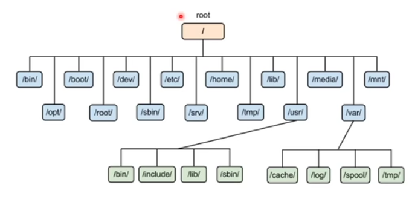

# LINUX BASICS 

## FILE STRUCTURE IN LINUX SYSTEMS

- / (root) – everything nested under this directory
- /bin – essential ready-to-run progs (binaries), includes basic cmds like ls , cp, etc
- /boot – contains kernel boot loader files
- /dev – device files i.e, config files
- /etc – core sys config directory[e.g. apt ], should hold only cofig files & no binaries
- /home – personal directories for users, holds ur docs files etc.
- /lib – hold library files that binaries can use
- /media – used as an attachment point for removable media like usb drives
- /mnt – temp mounted filesystems
- /opt -  optional appln sw pkgs
- /proc - Information about currently running processes
- /root - root user's home directory
- /run - Info about running system since the last boot
- /sbin - essential system binaries, requires root priv
- /tmp - storage for temporary files
- /usr - user installed software and utilities
- /var - variable directory, used for things that change constantly like system logging, user tracking, caches, etc. 

## TERMINAL COMMANDS
- echo
- pwd
- cd
- touch
- echo + >
- echo + >>
- cat
- less – shows one page of text doc at a time
- more – shows percent of text shown in page
- history – shows bash history  [clear using history -c]
- cp
- mv
- rm
- man
- whatis – shows minimum info of cmd
- ls
- alias – substitute a cmd with another one of our creation
- exit
- logout
- shutdown

NAT – using single public IP connect all devices to internet

1. Information gathering – collecting as much info about target, done by OSINT[Open source Intelligence]
2. Scanning networks – potential vulnerabilities find and exploit
3. Gaining access – exploit vulnerability and get privileged access
4. Mantaining access – install backdoors, trojans to keep getting info from system
5. Clearing logs – erase evidence of gaining access so that it cannot be traced to attacker