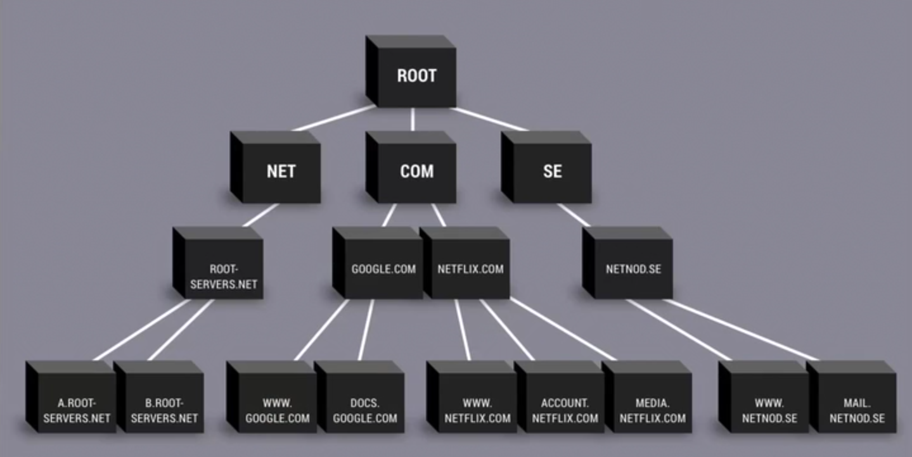
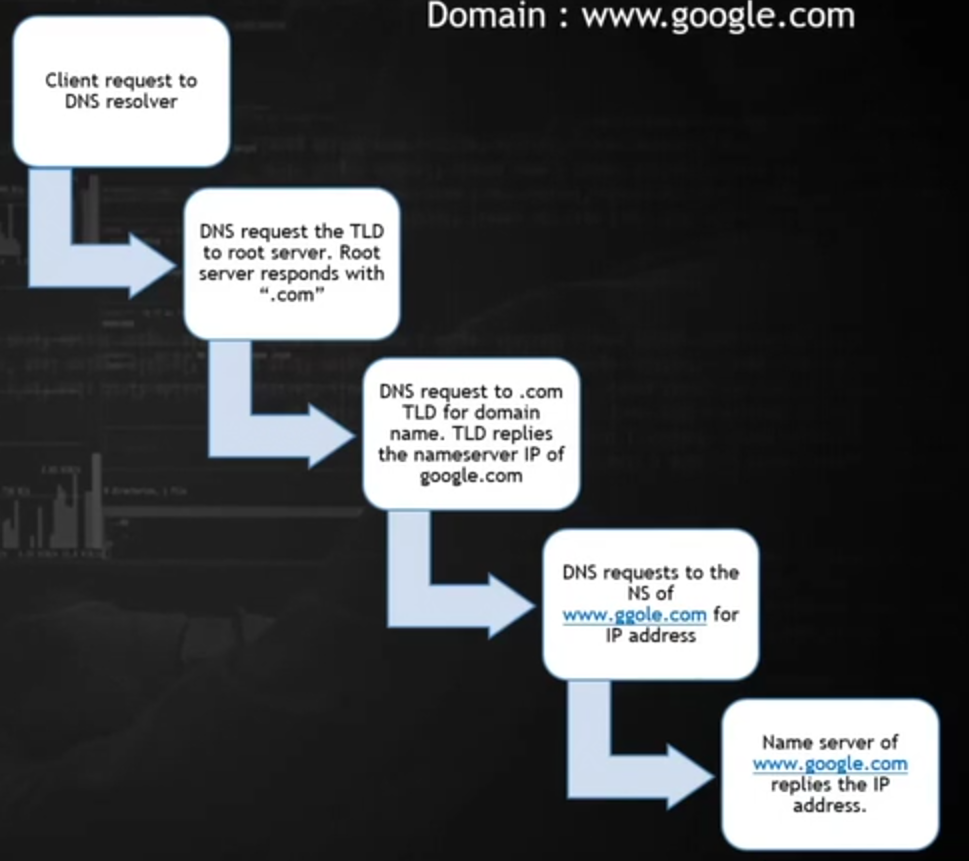
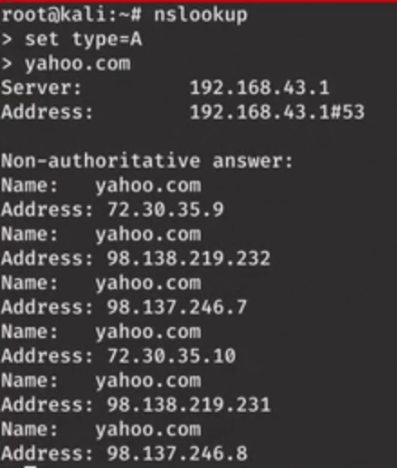
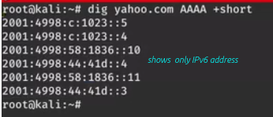
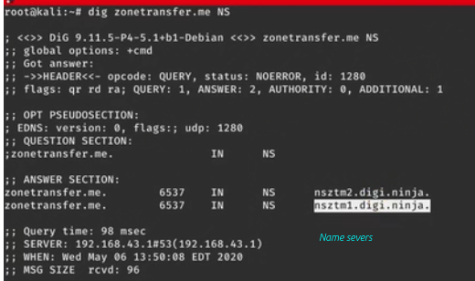
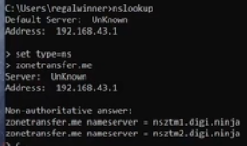
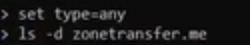

# DATA INTELLIGENCE
- Also called footprinting, reconnaisance
- Info gathering of 2 types : Passive & Active

## PASSIVE INFO GATHERING
- gathering info without establishing contact with target. e.g. website footprinting, DNS reconnaisance, email collection
- DNS recon : getting info form DNS[service converting domain name to ip address] , has record
   - A record : address record -> pointsdomain to an IP
   - CNAME record: canonical name -> redirects one domain to another,allowing you to update only one A record at each time you make a change       turns domain name we type into a fully qualified domain name (adds www in front of google.com)
   - MX entry:  mail exchanger entry -> directs email to a different server despite being a subdomain ,    specifies how email should be routed when sent to an address at your domain
   - TXT records:  text record -> provides info to external sources. Serves diff purposes depending on your needs.
   - AAAA records:  Same as A record, but allows to point to domain to Ipv6 addr
- 2 imp servers -> Root server & Top Level Domain
- Root server :  name server for root zone of DNS. Directly answers requests for records in root zone & answers other requests by returning a list of the authoritative name servers for appropriate top-level domain [TLD]
- Top Level Domain :  Last segment of the domain name [.com , .net , ]
  
  

## OSINT
OSINT can be done using different tools
- Maltego
   - create an account at site then login
   - haveibeenpwned Ipinfo  
- Recon-ng
   - run recon-ng in terminal
   - have to modules install
- theHarvester
   - useful for capturing emails
   - installed in kali
   - -l [limit flag] 		-d [domain flag]	-b [source flag]

- Shodan
   - search engine for devices connected to internet 
   - shodan.io
   - create account to use
- DNS
   - active info gathering
   - why? -> organisation structure can be discovered internal ip addr, etc
   - some methods given below
- Enumeration
   - tool called **host**. Eg. `host yahoo.com`
   - To specify query type, -t, Eg. `host -t ns yahoo.com`, `host -t A yahoo.com`, `host -t AAAA yahoo.com`
   - another tool **nslookup**. Eg. `nslookup yahoo.com`  
      
   - once set TYPE then it will be same until we change manually
   - another tool used **dig**. E.g. `dig yahoo.com AAAA`
      
- Zone Transfer
   - P4 level vulnerability
   - useful in colecting internal details of a company
   - records transfer from pimary dns to 2ndary dns is
   - works based on axfr protocol
   - can be captured by unauthorized users
   - practise it on digi.ninja/projects/zonetransferme.php
   - can also use **dig**
     
     
   - Using **nslookup**
      
      

## GOOGLE DDORKS
- site:
- inurl:
- intitle:
- -www  (shows subdomains by eliminating www in search results)
- filetype:	pdf	txt	csv	xlsx
- tesla @facebook, tesla @twitter (search within social media)
- related:
for more check ghdb
gbhackers google dorks cheat sheet
