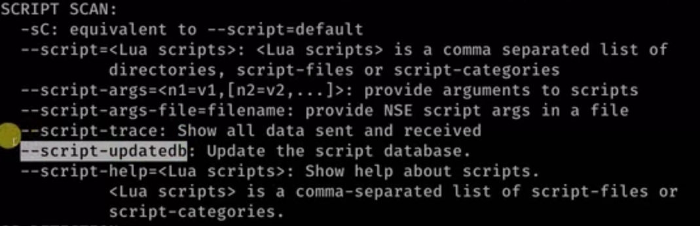

# NETWORK SCANNING

- set of procedures for identifying host ports and services
- discover live hosts, IP addresses, open ports, OSes, services running on hosts, vulnerabilities
- NMAP [network mapper] used for this
- type `nmap` in terminal to see common flag options
- script scanning is unique feature of NMAP [uses Lua prgmming lang]
## NMAP Basic Scanning
- target machine -> metasploitable 2
- in kali we scan with ARP scanning to get mac addr
- ARP [address resolution protocol]   -> progs use IP addr [logical addr] to send/recieve data but comm actuallu happens over physical layer using MAC addr. ARP translates IP addr to MAC addr. 
- Done with CAM table
- `arp-scan -l` 	gives virtual MAC addr
- then ping all ip addresses
- gateway IPs ignore, scan rest with nmap
## NMAP Multiple Targets scanning
- nmap <IP addr1> <IP addr 2>
- if within same range, 		nmap 10.0.2.5,7
- to scan an enitre range of ip addr	nmap 10.0.2.1-254
- ping scan ->  to find which devices are turned on and off 		nmap -sn 10.0.2.1/24
## TCP Connect Scan /Full open scan
- uses 3 way handshaking
- ensures targeted host id is live and the connection is complete
- can be detected by a firewall or IDS
- does not require super user privileges
- uses -sT flag
- e.g. nmap -sT  10.0.2.5
- -vv  ->  verbose o/p with greater effect
## Stealth Scan / Half open scan / Syn scan
- avoid detection by firewall/IDS
- SYN, SYN/ACK, RST  instead of SYN, SYN/ACK, ACK
- use  -sS flag
- arp-scan -l	nmap -sS <ip addresses>
- can capture packets in wireshark and analyse
## ACK Probe
- mainly used to detect if target runs firewall / IDS
- if RST packet recieved from target, no filtering	if no response, then traffic is being filtered
- scanme.namp.org  -> site for testing
- use `-sA` flag
- `nmap -sA scanme.nmap.org`
- set firewall on port 22 in metasploitable and run nmap
- `nmap -p 22 10.0.1.2`		for specifying port
## Service and OS detection
- service version detection useful to find and search for vulns associated with it
- OS detection useful for vuln usage and interacting with OS in apporpriate methods
- use -sV for version	-O for os detection
- output can be stored into text files using > operator
## Aggressive Scanning
- get multiple results from scan
- `nmap -A` enables os detection, version detection, script scanning and traceroute
- traceroute =>  route through which packet reaches your sys
- for traceroute only E.g. `traceroute www.google.com`
- in windows: `tracert www.google.com`
- uses -A flag
## UDP Scanning
- stands for User Datagram Protocol
- No flags for UDP packets
- no respone if port open else, msg given ICMP port unreachable
- flag is -sU
- takes time, not often used
## NMAP Output	
- nmap 10.0.1.5 > nmap.txt ; not preferred as it does not show output in terminal
- normal o/p -> `nmap -F scanme.nmap.org -oN normal.txt`
- XML format -> `nmap -F scanme.nmap.org -oX <filename>` 	can be used in webmap
- script kiddie format -> `nmap -F scanme.nmap.org -oS <filename>`	uses leetspeak, for fun
- grepable format -> `nmap -F scanme.nmap.org -oG <filename>`
- multiple formats -> `nmap -F scanme.nmap.org -oA <filename>`	create files in gnmap, nmap and xml formats
## Docker
- platform thatthat packages appln and all its dependencies together in form of containers
- https://medium.com/@airman604/installing-docker-in-kali-linux-2017-1-fbaa4d1447fe 
## Webmap
- install from github https://github.com/SabyasachiRana/WebMap 
- start docker webmap
- go to 127.0.0.1:8000
- `nmap -sS -sV -A vulnlocal.com -oX /tmp/webmap/test_rep.xml`
## Nmap Scripting
- NSE -> nmap scripting engine
- Various scripts pre-installed in nmap
- uses Lua prgming lang
- usr/share/nmap/scripts	location in kali

### Options in script scanning
- use flag -sC
- nmap -sV -sS -sC vuln <site>  -p <specify ports>
- vuln is a common script
- nmap –script=ssh-brute <site>
- `nmap –script=ssh-brute –script-args userdb=userslist.txt,passdb=passlist.txt`    bruteforcing using custom wordlist