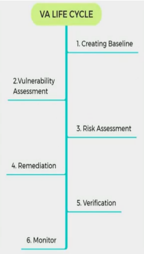

# VULNERABILITY ASSESSMENT
- vulnerability -> security weaknesses
- e.g. XSS, SQLi, OS vuln, open services
- vuln assessment definition -> process of examination, discovery, and identification of system and application security measures and weaknesses
- helps effectiveness of deployed security measures, identify vulns that could be exploited, need of additional security layers, and info that can be revealed by scanners
- vuln classified based on security level:  low, med, high, critical
- vuln classified based on exploit range: local, remote
- types:
   - active: probing target host; actively sending requests and examining response
   - passive: investigating without interacting with target host; includes pkt sniffing, running services, open ports, etc
   - internal: exploiting vuln within the target LAN
   - external: assessment from outside the LAN n/w
## VALC – Vulnerability Assessment Life Cycle
  
- Creating baseline: discover nature of corporate n/w, discover applns and services.  Create inventory of all resources and assets which help manage according to priority
- Vuln assessment: assessment of target. Includes examination and inspection of security measures [physical, security policies & controls]
- Risk assessment: scoping identified vulns and their impact on n/w or org
- Remediation: remedial action for detected vulns; order from critical to low
- Verification: ensure all vuln are eliminated
- Monitor: 
## Using NMAP to find Vulnerability
- vulscan in github
- it is an nmap script
- to update vulscan db  github.com/secretguard/vulnscan